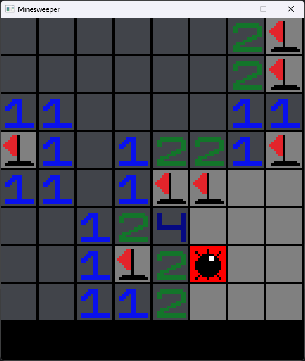
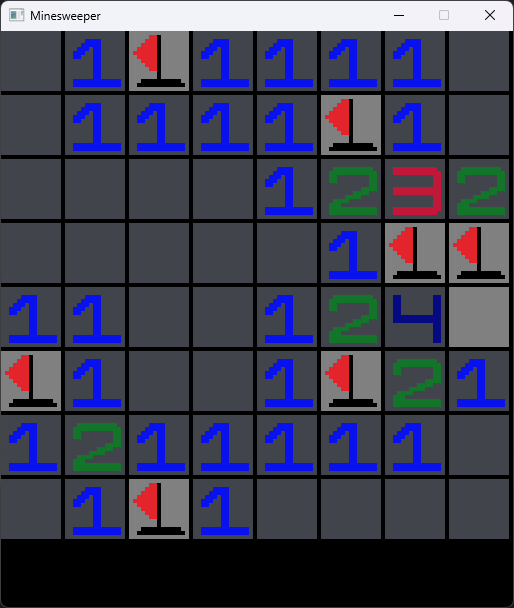

# MineSweeper

A MineSweeper clone crated using the SFML library for the simple API that gives a various of multimedia components. Made to practice C++ and Object Oriented Programming priciples, while experimenting for the first time with SFML and game development without using a game engine.

## To Do 

* A restart method for the player after finishing the game.
* Leaderboard based on the time the player needed to finish the game.
* Scenes for winning and losing the game (congratulating or wishing the player goodluck next time).
* Game music and sound effects.

## Example Use

